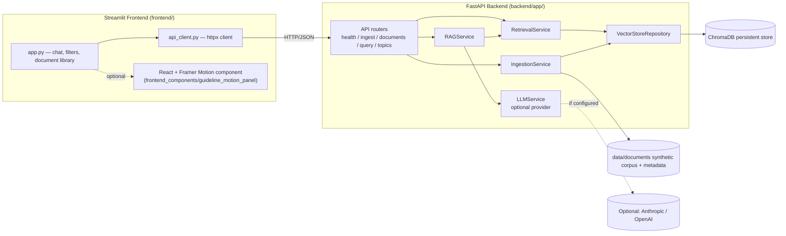

# GuidelineCheck — RAG-Based Public Health Guidance Assistant

> **Educational demonstration using synthetic guidance only. Not for clinical, patient-specific,
> or real-world operational decisions.**

GuidelineCheck is a retrieval-augmented generation (RAG) demo that helps a fictional public
health field team find the **currently applicable** guidance from a set of frequently updated,
entirely synthetic documents (outbreak protocols, vaccination guidance, advisories, and
operational procedures). It prioritizes **Current** guidance over **Superseded**, **Historical**,
or **Draft** material, always cites its sources with version/status metadata, and abstains
clearly whenever it cannot find sufficient support in the corpus.

This is **not** a clinical decision-support tool, does not use real government or health-agency
data, and never gives patient-specific medical advice.

---

## Product overview

- **Ingest** synthetic guidance documents (`.txt` / `.md` / `.pdf`) with required JSON metadata
  sidecars (`document_id`, `version`, `status`, `effective_date`, `supersedes`, etc.)
- **Chunk & embed** documents into a persistent ChromaDB vector store using
  `BAAI/bge-small-en-v1.5` sentence embeddings
- **Retrieve** with a metadata-aware reranker that prioritizes Current guidance, but can
  intentionally surface Superseded/Historical material when a user explicitly asks for it
  (e.g. "show the historical protocol", "what changed between versions")
- **Generate** a grounded answer strictly from retrieved context, with structured output
  (answer, abstention flag, confidence, citations) validated by Pydantic
- **Abstain safely** when retrieval is weak, contradictory, or the question asks for
  patient-specific medical advice
- **Run without any LLM API key** via a deterministic extractive fallback mode that still cites
  sources and still abstains correctly
- **Streamlit UI** with filters, chat history, source cards, a document library/version-history
  view, and an optional React + Framer Motion panel for subtle animated transitions

---

## Architecture



---

## Folder structure

```
GuidelineCheck/
├── README.md
├── .env.example
├── .gitignore
├── docker-compose.yml           (optional)
├── Dockerfile.backend           (optional)
├── Dockerfile.frontend          (optional)
├── .streamlit/
│   └── config.toml              # Streamlit theme
├── backend/
│   ├── requirements.txt
│   ├── app/
│   │   ├── main.py              # FastAPI app entrypoint
│   │   ├── api/                 # Routers: health, ingest, documents, query
│   │   ├── core/                # config.py, logging_config.py
│   │   ├── models/               # DocumentMetadata, GuidanceStatus, DocumentChunk
│   │   ├── schemas/              # Pydantic request/response schemas
│   │   ├── services/             # ingestion, retrieval, rag, llm, document services
│   │   ├── repositories/         # VectorStoreRepository (ChromaDB access)
│   │   └── utils/                # document_loader.py, chunking.py
│   └── tests/                    # pytest suite (offline-safe, see below)
├── frontend/
│   ├── requirements.txt
│   ├── app.py                    # Streamlit app
│   ├── api_client.py             # httpx client for the backend
│   ├── styles.py                 # CSS theme + static fallback rendering helpers
│   └── motion_panel.py           # Safe loader for the React component
├── frontend_components/
│   └── guideline_motion_panel/   # React + TypeScript + Framer Motion component
│       ├── src/
│       ├── dist/                 # Prebuilt — works out of the box
│       └── README.md
├── data/
│   └── documents/                # Synthetic corpus (.md + .json metadata sidecars)
├── storage/
│   └── chroma/                   # Persistent ChromaDB data (created on ingestion)
└── scripts/
    ├── ingest_documents.py       # CLI ingestion
    └── evaluate_rag.py           # Sample-query evaluation script
```

---

## Prerequisites

- Python 3.11+
- Node.js 18+ and npm (**only** if you want to rebuild the React component — a prebuilt
  `dist/` is already included, so this is optional)
- ~1–2 GB free disk space (mostly for the sentence-transformers embedding model on first run)

---

## Environment variable setup

```bash
cp .env.example .env
```

Key variables (see `.env.example` for the full list with defaults):

| Variable | Purpose | Default |
|---|---|---|
| `CHROMA_PERSIST_DIR` | Where the vector store persists | `storage/chroma` |
| `DOCUMENTS_DIR` | Where source documents live | `data/documents` |
| `EMBEDDING_MODEL_NAME` | Sentence-transformers model | `BAAI/bge-small-en-v1.5` |
| `LLM_PROVIDER` | `none` \| `anthropic` \| `openai` | `none` |
| `ANTHROPIC_API_KEY` / `OPENAI_API_KEY` | Only needed if `LLM_PROVIDER` is set | *(empty)* |
| `GUIDELINECHECK_API_URL` | Backend URL used by the Streamlit app | `http://localhost:8000` |

**No API key is required.** With `LLM_PROVIDER=none` (the default), the app runs fully offline
using the deterministic extractive fallback, and every acceptance criterion in this README still
holds.

---

## Backend installation & run

```bash
cd backend
pip install -r requirements.txt --break-system-packages   # or use a virtualenv
cd ..

# From the project root:
uvicorn app.main:app --reload --app-dir backend --host 0.0.0.0 --port 8000
```

The API will be live at `http://localhost:8000`, with interactive docs at
`http://localhost:8000/docs`.

---

## Document ingestion

Before querying, ingest the synthetic corpus into ChromaDB:

```bash
python scripts/ingest_documents.py
# or, to rebuild the vector store from scratch:
python scripts/ingest_documents.py --reset
```

You can also trigger ingestion from the running API (`POST /api/v1/ingest`) or from the
Streamlit sidebar's **Admin: (re)run ingestion** panel.

Ingestion prints a summary (documents ingested/skipped/failed, chunks created) and is
duplicate-safe: re-running without `--reset` skips documents already indexed.

---

## Frontend installation & run

```bash
cd frontend
pip install -r requirements.txt --break-system-packages
cd ..

streamlit run frontend/app.py
```

The app opens at `http://localhost:8501` and expects the backend at `GUIDELINECHECK_API_URL`
(default `http://localhost:8000`).

---

## React component installation & build (optional)

A prebuilt `dist/` is already included, so **you do not need Node.js to run the demo**. If you
want to modify the animated panel:

```bash
cd frontend_components/guideline_motion_panel
npm install
npm run build     # regenerates dist/, picked up automatically on next Streamlit run
```

If the component ever fails to load (missing `dist/`, build error, etc.), the Streamlit app
automatically falls back to plain static rendering — no functionality is lost.

---

## Running tests

```bash
cd backend
PYTHONPATH=. python -m pytest tests/ -v
```

The test suite is fully **offline-safe**: it uses a lightweight deterministic fake embedding
function instead of downloading the real sentence-transformers model, while still exercising
real ChromaDB persistence, retrieval ranking, ingestion, abstention, and the full FastAPI
surface via `TestClient`. All 24 tests pass.

Run the sample-query evaluation script (uses the real configured embedding model/backend):

```bash
python scripts/evaluate_rag.py
```

---

## Example questions

- "What is the current measles outbreak vaccination protocol?"
- "Which document supersedes the previous measles protocol?"
- "Show the historical measles vaccination protocol."
- "What is the current mpox field guidance?"
- "What should I prescribe for a patient with measles?" *(abstains — patient-specific advice)*
- "What guidance exists for an outbreak on Mars?" *(abstains — out of corpus)*

---

## Known limitations

- The corpus is small and entirely synthetic; retrieval quality reflects a demo-sized dataset,
  not a production knowledge base.
- The deterministic extractive fallback (used when no LLM key is configured) produces a
  templated summary rather than a fluent generated answer — it is intentionally conservative.
- No authentication, multi-user support, or production deployment hardening is included by
  design (this is a local/demo application).
- The React Framer Motion component targets modern evergreen browsers; no legacy-browser
  polyfills are included.
- Embedding downloads (`BAAI/bge-small-en-v1.5`, ~130MB) require outbound network access to
  Hugging Face on first run; after that, the model is cached locally.

---

## Synthetic-data & educational disclaimer

**Every response includes this notice, and it bears repeating here:** GuidelineCheck is an
educational demonstration built entirely on synthetic guidance documents. It does not use real
government, health-agency, or clinical data, is not a clinical decision-support system, does not
provide patient-specific medical advice, and must not be used for real-world operational or
medical decisions.
